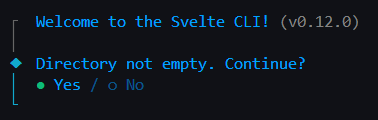
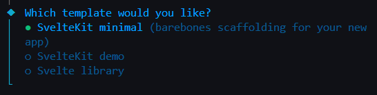
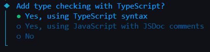
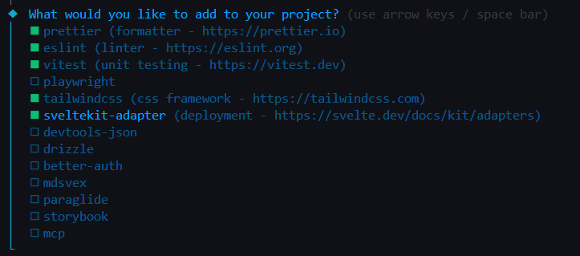
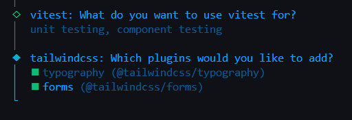
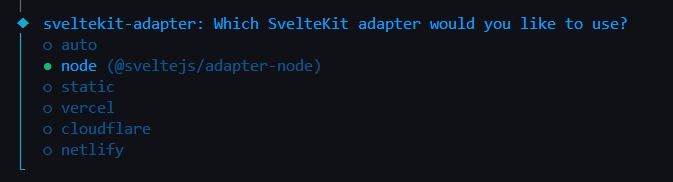
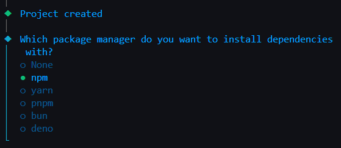
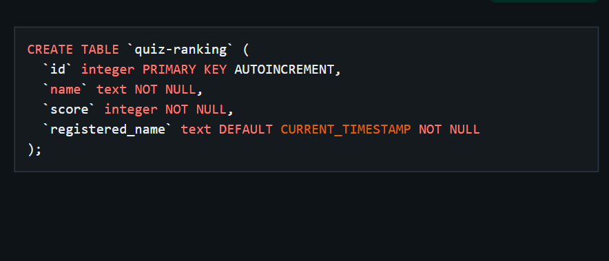

# Quiz-Game

Creating a simple quiz game (English-Japanese based) to test user Japanese language proficiency. We integrated SvelteKit framework for front-end, TypeScript as part of back-end integration, and Turso for database.

This project aims for simulating a real-world working environment, be able to collaborate with team members, understanding client requirements, and write documentation.

In this group project, the README.md file is intentionally designed as a guildline to ensure all team members have leverage access to shared resources and can stay aligned and work efficiently. To enable team members to learn and explore comprehensively, this guideline will be divided into `Quick Setup` and `Build From Scratch`

### ⚠️ Prerequisite

---

[Node.js installation](https://nodejs.org/en/download/current)

To confirm it properly installed run: `node -v` then `npm -v`

<br>

## **Quick Setup**

if you have not cloned from repository, run command:

```bash
git clone https://github.com/Ngovkimyou/Group2---button-counter.git
cd quiz-game
npm install
npm run dev
```

if have already cloned, run command:

```bash
git pull
npm install
npm run dev
```

from `npm run dev`, click the provided url http://localhost:5173/ to test it out. If it show a default welcome page, then the framework setup is done!

💡Get to know this framework, database integration, and code execution, please visit **Build From Scratch** ➡️ Start working on **Front-end Working Place**, **Back-end Configuration**, **Turso Database Connection**, and **Code Execution and Flowchart**.

<br>

## **Build From Scratch**

<details>
<summary><h2>📥 TypeScript Installation</h2></summary> 
  
```bash
npm install -g typescript
```
This will be installed globally allowing you to execute `tsc` command anywhere in your terminal.

To confirm it properly installed run: `tsc -v`

</details>

<details>
<summary><h2>🛠️ SvelteKit Integration</h2></summary>

Inside **Group2---button-counter** folder, run command:

```bash
npx sv create .
```

Target this step-by-step:

<p>
  

  

  

  

  

  

  

</p>

After setup:

```bash
npm install
npm run dev
```

The application runs locally at http://localhost:5173

</details>

<details>
<summary><h2>🖼️ Front-end Working Place</h2></summary>

`src/routes/+page.svelte` is the SvelteKit equivalent of `index.html`

To create an external **CSS** file, under **routes** folder, create `app.css`. After that in `src/routes/+layout.svelte` import its path. For example: `import '../app.css';`

If you have multiples **CSS** files, it's a good practice to organize in `src/styles/<ALL-YOUR-CSS-FILES>`, then import all those names in `src/routes/+layout.svelte`.

</details>

<details>
<summary><h2>⚙️ Back-end Configuration</h2></summary>

This is where front-end requests to fetch data from database. Since we are using **Turso** as database, an authentication is needed to be stored safely in `.env` file.

### 🔧 Creat `.env` file

This is where you store your credential token and url from Turso.
Simply create a file in your project and name `.env` or create via command:

**Window:**

```bash
ni .env
```

**macOS / Linux**

```bash
touch .env
```

Copy this into your `.env` file.

```md
# Environment variables for Turso database connection

TURSO_DATABASE_URL= <YOUR TURSO ACCOUNT URL>
TURSO_AUTH_TOKEN= <YOUR TOKEN>
```

⚠️ To get your token and Turso url, go to **Turso Database Connection** section.

<br>

### 🔧 Create `+server.ts` files

This is where your back-end communicates with database.
These `+server.ts` are where we will be working on with the back-end coding.

<br>

⚠️**Note:** During `npm run dev` if an error message with **adapter-auto** module not found appeared, worry not, this is common setup issue when we chose **Node Adapter** during SvelteKit setup. In **svelte.config.js** file, you likely have this line `import adapter from '@sveltejs/adapter-auto';` this adapter-auto might not exist on your node module. Instead, we install **adapter-node** run:

```bash
npm install -D @sveltejs/adapter-node
```

After that, in **svelte.config.js** change to `import adapter from '@sveltejs/adapter-node`

⚠️**Note:** if you use custom modules / libraries and ever encounter those being undefined or unregconized, make sure you properly install on your project folder, otherwise run `npm install` for default dependacies. Go check **package.json** file for more details.

</details>

<details>
<summary><h2>📊 Turso Database Connection</h2></summary>

- Go to [Turso](https://turso.tech/) and create account
- ➡️ **Create Database** ➡️ In **Overview** tab, copy the url and create your token which are needed in `.env` file.
- ➡️ Go to your database **Edit Data**, click plus button to create a table, then setup all necessary columns requirements.

In this project case:

<p align="center">
  
</p>

</details>

<details>
<summary><h2>🗺️ Code Execution and Flowchart</h2></summary>

Once you have done with new changes, execute the following commands:

**Production ready**

```bash
npm run build
npm run preview
```

<br>

💭*Optional*

If you prefer to work on development mode that automatically recompiles on change:

```bash
npm run dev
```

<br>

_💡 Useful Tips_ : It is recommend to run `npm run dev` during performing changes, and everytime you have done with changes excecute `npm run build`.

<br>

### 🗺️ Flowchart

```txt
[ User : Click the button]
   |
   v
[ Frontend ]
   |
   |  HTTP Request
   v
[ Backend Server ]
   |
   |  SQL Query
   v
[ Turso Database ]
   |
   |  Result
   v
[ Backend Server ]
   |
   |  JSON Response
   v
[ Frontend ]
   |
   v
[ Updated Count Displayed ]
```

</details>
